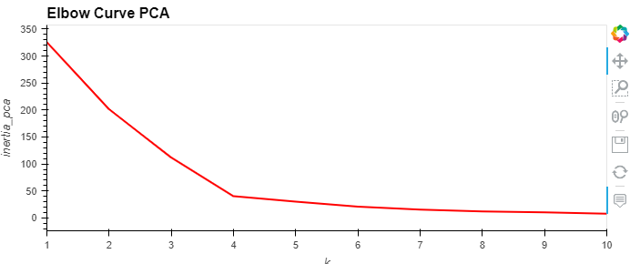
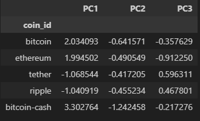

# CryptoClustering-Analysis

## Introduction
This challenge assignment required us to use an unsupervised learning model to predict if cryptocurrencies are affected by 24-hour or 7-day price changes. Data was prepared using the StadardScaler function, and then the best value for 'k' was determined using the original scaled data. Clusters were then plotted using the results.

Clusters were then optimized using Principal Cluster Analysis (PCA). 'k' was plotted using the PCA data to determine the best number of clusters to use, and then clusters were plotted using this information.

Finally all charts were displayed side-by-side to determine best approach.

* README.md - ReadMe file for the project.
* Crypto_Clustering_final - completed Jupyter notebook.
* Resources folder - contain the cryto_market_data.csv with starter data

# **Results**

The original scaled data when plotted using 'k' showed a best fit of four clusters.

Even so, some of the clusters overlapped in such a way that it could be determined this was a poor fit. 

Clusters were created using PCA and total explained variance was calculated to be 89.5% for the three components. This number predicts that PCA will probably be a better predictor than the standard model which included many more features. Plotting 'k' for the PCA data displayed a lower inertia overall, and also showed that four clusters would be optimal.

A dataframe was created using the PCA data.

And finally, the clusters were plotted.

Clustering using PCA shows a much clearer distinction between groups which would result in a better model prediction for unsupervised learning.
  
